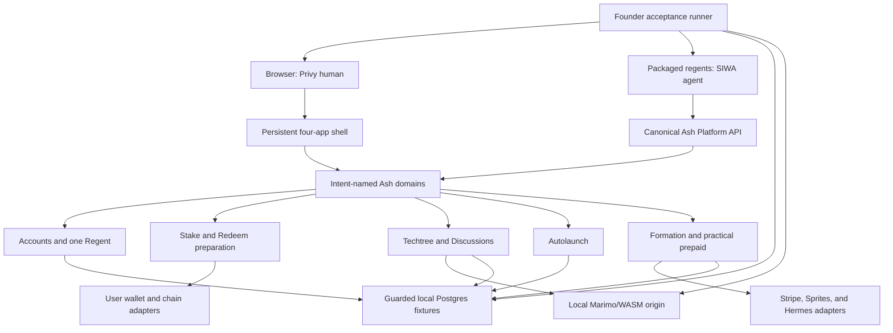
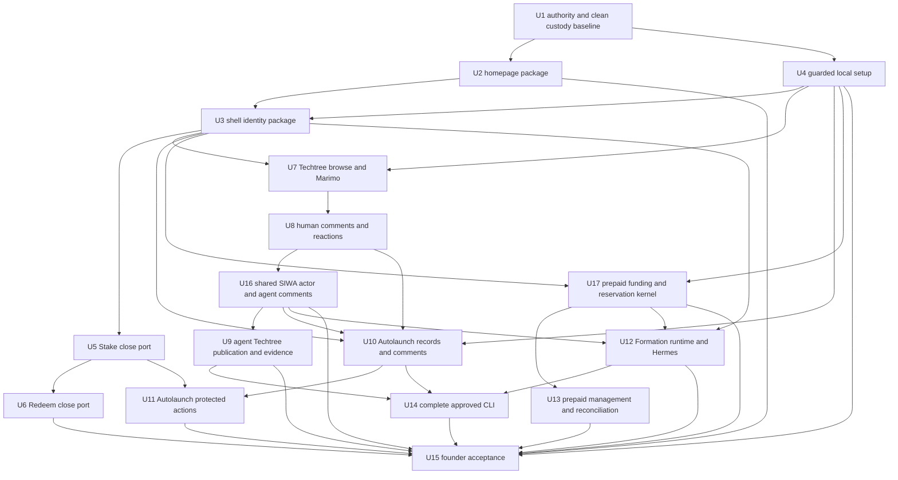

# Local Founder Acceptance - Plan

## Goal Capsule

- **Objective:** Produce one clean, locally reproducible `ash-platform` beta that proves the founder-approved browser and agent journeys, with the plural `regents` CLI operating against the running application.
- **Authority:** The current founder goal and `docs/ASH-PLATFORM-DIRECTIVES.md` define the intended product. Before capability implementation continues, U1 must reconcile `founder.md`, `metaprogramming/stack.yaml`, repo contracts, and interface ownership so those active machine and human sources name the same Ash Platform boundary. Old tickets, specs, handoffs, and implementation notes remain evidence only. Owning contracts override producers and consumers. Onchain state owns money and ownership. Product databases own workflow state.
- **Protected state:** Never drop, reset, rewrite, or rehearse against the live `platform_human_users`, `basenames_mints`, `basenames_mint_allowances`, or `basenames_payment_credits` datasets. Local acceptance uses guarded fixtures only.
- **Execution profile:** Build capability-first vertical slices with Ash domains and intent-named interfaces. Use one integration custodian for shared shell, contract, configuration, dependency, migration, and generated-artifact files. Each implementation or review delegate loads Regent Workflow and Ash Framework, plus Regent UI for visible work and the relevant boundary skills.
- **Stop conditions:** Stop before any production database contact, deploy, live provider mutation, live money movement, contract deployment, package publish, or destructive operation outside a guarded local fixture. Stop on a contract conflict, protected-data ambiguity, or product decision not resolved by the founder directives.
- **Landing:** `ash-platform` capabilities land as reviewed local commits from clean candidates. `regents-cli` lands only contract-backed commands and preserves its sealed unrelated generated changes. Push or release only where a configured remote exists and the active Regent instructions and user authorization allow it.

---

## Product Contract

### Summary

Build a small canonical Ash application around the founder capabilities, package only work that survives a clean checkout, and prove the complete browser and agent experience through one guarded local acceptance run.

### Problem Frame

The greenfield application has a credible committed foundation, but most product capabilities currently live in a broad dirty worktree or in private candidates. Ticket closure and isolated test evidence therefore overstate what a fresh checkout can run. Shared shell, frontend entrypoint, configuration, dependency, contract, migration, and generated files also carry overlapping work from several product lanes.

The solution is not to sweep the dirty tree into one commit or reproduce the old Platform architecture. Each founder capability must be re-admitted from current directives and contracts, implemented through Ash domain interfaces, reviewed in a clean candidate, and imported in dependency order. The final proof must start from immutable commits, use deterministic local providers, and leave no database fixture, process, socket, listener, temporary directory, generated output, or worktree residue.

### Actors

- A1. A signed-out browser visitor who can read public marketing, Techtree, Autolaunch, and public Regent content.
- A2. A Privy-authenticated human whose server-verified account owns at most one Regent and a set of verified connected wallets.
- A3. The connected human wallet selected for a protected browser action; it signs exactly that action and is reconciled against the resulting receipt and onchain reread.
- A4. A SIWA-authenticated agent using the local `regents` CLI and its own local signer, never a Privy browser session or human wallet authority.
- A5. A configured Regent administrator wallet that may perform the narrow moderation actions named in the directives.
- A6. A local developer or founder running guarded setup, reset, browser acceptance, provider fakes, and the packaged CLI.
- A7. External providers such as Privy, Stripe, Sprites, RPC, ENS, and notebook origins, represented by bounded production clients and deterministic local test adapters.

### Requirements

#### Foundation and data safety

- R1. `ash-platform` remains a separate Phoenix, LiveView, and Ash application with no runtime or code dependency on the quarantined old Platform application.
- R2. The four protected datasets remain untouched by local setup, reset, tests, and acceptance. The only compatibility exception is a run-owned `platform.platform_human_users` row inside the disposable loopback acceptance database when an admitted foreign key requires it; exact host, role, database prefix, run marker, schema, row identity, and dependency-safe cleanup are mandatory. The other protected names and all non-local identities remain forbidden.
- R3. One documented setup command installs locked backend and frontend dependencies, creates only an approved local database, migrates, seeds deterministic fixtures, builds assets, and fails closed for unsafe database targets.
- R4. Current stable dependency versions are re-queried from authoritative registries immediately before each dependency lock change; prereleases require explicit approval.
- R5. Old tickets, specs, handoffs, and dirty-tree implementations are evidence only. A capability counts as complete only after clean-candidate review, import, and clean-checkout verification.
- R55. Before product implementation resumes, the active founder, stack, repo, HTTP, CLI, runtime, and chain-contract sources agree on Ash Platform ownership. The exact `elixir-utils` Privy dependency commit is pinned as part of the reproducible checkout.

#### Identity, shell, and presentation

- R6. One click on Sign In completes the Privy browser flow and immediately updates the persistent account control without a second click. Provider cancellation, verification failure, local-session failure, expiry, and renewal failure surface a recoverable account-level state instead of a silent no-op. Privy remains outside the anonymous initial bundle; the first click shows pending feedback within 100 ms, fetches no more than 1 MiB of new gzip-compressed JavaScript before provider readiness, and targets provider readiness within 2.5 seconds on Fast 4G.
- R7. Browser identity is derived from verified server session evidence. Browser-provided wallet, role, profile, or ownership claims never become authority.
- R8. The account control shows an address-derived avatar and resolved identity. Public display identity resolves in this order: profile-selected label, `<name>.regent.eth` claim, ENS, shortened wallet; resolution failure never affects authentication. Its menu shows Profile only when the account owns a Regent, then Settings and Log Out in that order. `/settings` is a canonical signed-in shell route, not an app root.
- R9. The fixed desktop/tablet shell and full-feature mobile shell expose Formation, Autolaunch, Techtree, and Regents Labs through one app selector and app-local contextual navigation. The upper-left selector is one line—crown, active app name, chevron—and always opens the selected app root rather than remembering its prior route. The separate upper-right account control never shares its disclosure. Desktop navigation stays visible; mobile exposes the same routes through an accessible temporary menu. Header search appears only for Autolaunch and Techtree. Formation orders Overview, Cloud, Hermes Skills, Billing; Autolaunch orders Auctions, Tokens, Create; Regents Labs orders Overview, Stake, Redeem, Profile; Techtree orders the five founder roots with Map/List selectors.
- R10. Navigation commits URL and application state immediately, is cancellable and latest-destination-wins, preserves native history, starts route destinations at scroll top, and never disables the shell when content fails.
- R11. The approved homepage uses the Prime-inspired marketing header, founder mat hero, four product tabs, and four substantive product chapters, preserving the strongest content density and product storytelling without requiring literal old-page parity. Its structural material, background, Settings-owned System/Light/Dark theme control, square geometry, reduced-motion, keyboard, no-JavaScript, responsive, and 200%-zoom behavior is packaged from clean files rather than depending on the mixed shared checkout. System follows later operating-system changes; theme changes are color-only; app switches use the approved cancellable 5–8-region choreography while local updates do not trigger scene travel.
- R12. Customer-facing copy describes user outcomes and never exposes implementation or compatibility language.

#### Regents Labs and user-signed value actions

- R13. Regents Labs provides Overview, Stake, Redeem, and conditional Profile destinations under the persistent shell. Overview summarizes identity, selected wallet, admitted balances, staking/reward state, and truthful next actions with explicit loading, empty, unavailable, and error states.
- R14. Stake preserves the working old-Platform experience: stake, unstake, claim USDC, claim REGENT, and manual claim-and-restake, including the admitted alternate receiver and ENS resolution behavior.
- R15. Redeem preserves the working old-Platform NFT-to-REGENT experience: eligibility, required approvals, redeem, and claim, without importing the separate planned Stripe-credit redemption idea.
- R16. Every protected browser action is prepared from the canonical `chain-contracts.yaml` source for Base and binds owner product, resource identity, selected signer, beneficiary, chain, target, calldata and calldata hash, native value, approval amount or token ID, action identity, idempotency key, simulation result, risk copy, slippage or minimum-output bound where applicable, and bounded expiry. The selected connected Privy wallet signs once; a paymaster may sponsor gas but never changes a bound field or authority.
- R17. Confirmation rejects wrong chain, sender, target, input, native value, beneficiary, resource/action identity, expiry, expected event, receipt status, approval bound, or authoritative reread. One transaction hash confirms at most one action identity. Pending and tentative finality stay distinct from final success; user rejection stays cancelled; replacement, reorganization, and duplicate confirmation converge safely.
- R18. Automated Stake and Redeem proof uses fake providers and wallets and never submits live value.

#### Techtree human experience

- R19. `/techtree` explains the product and verified agent participation path and links to the five roots in founder order: GeneBench-Pro Reference Lab, Question Forge Metaskills, New Question Candidates, BixBench Capsule Lab, and Skill Training Lab.
- R20. `/techtree/:tree_slug` owns both Map and List presentations. The tree name preserves the active mode, Map/List controls choose the requested mode, and `nodes` is not a valid tree slug.
- R21. The Map presentation is an actual starmap of the current tree model, not a decorated list. List can slide over Map on the same route, with equivalent keyboard, touch, reduced-motion, and cancellation behavior.
- R22. `/techtree/nodes/:node_id` shows the canonical node, stable address, provenance, current payload evidence, and available local Marimo notebook artifact.
- R23. Notebook execution is user-started and WASM-based on a separate opaque local origin. The export is content-addressed and self-contained from named locked inputs, and a manifest proves every runtime asset hash. It runs in a restrictive iframe sandbox with no ambient credentials or storage, strict message source/origin checks, zero external requests, bounded time and memory, locally allowlisted runtime assets, hash verification, worker termination, and honest loading, ready, failed, timeout, resource-limit, and unsupported states. If a notebook cannot satisfy this offline contract, the product shows unsupported rather than silently enabling network access.
- R24. The initial browser remains read-only for node creation. Humans may write only comments and human reactions.
- R25. Human comments are flat, newest-first, immutable, restricted-Markdown records of at most 2,000 grapheme clusters after canonical normalization and a strict request-byte ceiling before parsing. Target visibility is rechecked on every read and real-time reread; author or configured admin may delete; public output has no tombstone while the atomic private audit records who deleted and under which authority.
- R26. A human may keep one current comment reaction from Useful, Off-topic, or Negative. Reactions never reorder comments, and browser humans cannot use the agent evidence vocabulary.
- R27. Real-time inserts preserve the reader's position and queue behind an accessible `N new comments` control. Activating it reveals the queued newest entries, moves focus to the first new entry without an unrequested animation, and clears the count once the reader reaches them.

#### Techtree agent experience

- R28. Agent authentication uses shared SIWA verification and a local agent signer through a separate contract and transport boundary from Privy browser sessions. Shared SIWA remains the sole nonce, signed-envelope, and replay authority; Ash Platform consumes a verified receipt and maps it to a local actor instead of creating competing replay state. The mapping is derived only from the verified wallet, chain ID, registry address, token ID, audience, and derived `agent_id` tuple; caller-supplied IDs and display labels are never authority. Every write then reloads current product-local agent/account status and action-specific ownership or workflow permission; suspended, revoked, unpaired, wrong-owner, wrong-tuple, or otherwise ineligible actors are denied.
- R29. The initial agent can list trees and nodes, get a node, publish a child node, publish a notebook artifact, add or delete its own comment, fetch the full node payload, and set or remove one evidence reaction per stable node address.
- R30. Agent publication is idempotent, parent-bound, principal-bound, and provenance-bearing. Web users cannot publish nodes in the initial launch.
- R31. An agent evidence reaction is admitted only after verified delivery of the full current node payload. The server places an unpredictable one-use completion token only in the final framed bytes—not headers or preflight metadata—and rejects range delivery for this proof. A product-owned delivery record is created only after a SIWA-signed acknowledgement binds that token, agent, audience, stable node address, immutable payload version and hash, exact byte length, issued time, and expiry. It may be reused by that agent only for the same unchanged node version until expiry; a changed version requires a new delivery record before the reaction can be changed. It does not reuse SIWA replay secrets.
- R32. The one mutable agent reaction per agent and stable node address uses exactly: Evidence checks out, Result reproduced, Useful, Needs evidence, Contradicted, or Could not reproduce. It stores the reviewed payload hash and timestamp, survives later payload-hash changes, and remains publicly countable historical provenance while making clear which bytes it covered. Removing it removes the current reaction record; changing it after a payload change requires a fresh R31 delivery record.
- R33. Agent comments use the same immutable comment capability and visibility rules as human comments, but retain SIWA principal authority and never expose SIWA internals publicly.
- R34. Initial Techtree has no paid payloads, x402, browser publishing, or old numeric-ID/vote contract.

#### Autolaunch

- R35. `/autolaunch` presents recent and featured auctions, top tokens, and recently graduated tokens with honest loading, empty, and error states.
- R36. A signed-in human can create and validate a launch draft, optionally connect verified X, Farcaster, ENS, and World reputation, review the launch, and prepare the admitted auction actions. Profile and Autolaunch Create both expose connect, verified, expired, retry, and remove states; the UI recommends all four signals without treating any as required or as signing authority.
- R37. Browser money actions remain user-signed. Pairing or agent visibility never grants signing power.
- R38. The initial web path covers the admitted auction lifecycle with deterministic local chain adapters: start, bid, exit or reclaim where applicable, finalize, claim, and admitted token actions.
- R39. Auction and token comments use the shared immutable comment capability, newest-first, with no reactions or score.
- R40. The approved initial CLI surface is limited to auction/token reads, launch draft create/get/validate, action preparation, and auction/token comment add/delete. It never submits a human wallet action.

#### Formation and practical prepaid

- R41. `/formation` is one lifecycle with Overview, Cloud, Hermes Skills, and Billing panels, and at most one owner-bound Regent per HumanAccount.
- R42. Formation creates and manages the Regent profile, establishes one durable Regent/runtime claim, and provisions one Sprite idempotently only after prepaid admission succeeds. Provider idempotency and reconciliation prove one external Sprite as well as one local row, including provider-success/database-failure recovery, then expose bounded status and admitted pause/resume/health actions.
- R43. Hermes profiles, skills, chat/execution, and plugin status are real capability surfaces. ChatGPT provider/account integration remains; retired public/private messaging does not return.
- R44. Customers fund one Stripe Billing Credits grant before Sprite or hosted-AI work. Both usage sources debit that same customer grant exactly once. The Ash ledger owns admission, reservations, immutable accounting history, and the verified local projection of that provider balance; it is never an independent spendable shadow balance. A provider/local mismatch immediately blocks new reservations, requests pause, and surfaces unresolved exposure until reconciled.
- R45. Every start, resume, restore, exec, service wake, and reconciliation wake requires a persisted renewable spend lease with `authorized_through` and a maximum reserved cost. Renewal happens before expiry; failure triggers a pause-before-expiry watchdog and denies further admitted wakes. Runtime control distinguishes `pause_required`, `pause_requested`, `pause_confirmed`, and `exposure_unresolved`; local acceptance proves reservation, lease, admission, and pause state with a fake provider but never claims a real billing cutoff without a durable provider acknowledgement, documented maximum billable delay, activity behavior, and resource-cost ceiling.
- R46. Stripe top-up and refund ingress retains untouched raw bytes, verifies signature and timestamp, parses once, validates endpoint/account, livemode/environment and event type, retrieves authoritative provider state, and matches customer, owner, currency, amount, mode, and status before admitting processing. Invalid signatures create no inbox identity, and rejected validation never consumes the ledger idempotency identity needed by a later valid delivery. Admitted events then persist one inbox identity and converge under duplicates, reordering, timeout, exhausted retry, and crash recovery. Test adapters and Stripe test mode never imply production entitlement.
- R47. Daily maximum, persisted auto-recharge consent and revocation, threshold, amount, currency, cap, reservation expiry, delayed usage, refunds limited to unspent refundable credit, disputes, chargebacks, provider reversals, small exceptional exposure, provider failure, and user-visible reconciliation are bounded, monitored, and durably evidenced. A reversal is immutable, preserves consumed history, blocks new reservations, requests runtime pause, and exposes any unrecoverable deficit.
- R48. The approved Formation CLI surface covers runtime create/get/pause/resume/health, Hermes connection and chat, and plugin status through agent authority; it does not expose Stripe money controls.

#### CLI and final acceptance

- R49. The executable remains plural `regents`; no singular alias, fallback, or dual command is introduced.
- R50. Clean-built `regents --help`, version, `regents run`, and doctor operate against the exact running `ash-platform` contract and report only checks admitted by that contract.
- R51. CLI auth, identity, and Regent commands use the canonical agent-auth and agent-identity contracts; they never reuse Privy browser cookies.
- R52. Each approved CLI command lands only after its owning YAML contract, backend operation, generated bindings, and reset fixture are immutable. Conflicting legacy messaging, paid-payload, numeric-node, ranked-comment, and vote command surfaces are removed rather than preserved beside the greenfield contract.
- R53. The final packaged CLI proves the approved initial families: run/doctor; agent auth and identity; Regent read; Formation runtime/Hermes; Techtree reads/publish/notebook/comments/evidence reactions; and Autolaunch reads/drafts/action preparation/comments.
- R54. One founder acceptance command builds clean packages, starts the app and notebook origin, exercises desktop and mobile browser journeys and every admitted CLI command, stops all children, resets twice, restores all owned tables to the post-setup baseline, and leaves no orphan, active reservation, unsettled event, runnable job, provider object, process, socket, listener, temporary directory, generated output, or Git change.

### Key Flows

- F1. Clean local start
  - **Trigger:** A6 checks out the admitted application and CLI commits.
  - **Actors:** A6.
  - **Steps:** Run the documented setup; guard the product and SIWA database targets; install exact locks; migrate and seed deterministic fixtures; start the pinned SIWA service, application, and local notebook origin.
  - **Outcome:** The browser and packaged CLI are ready without production contact or untracked output.
  - **Covered by:** R1-R5, R54, R55.
- F2. First-click browser identity
  - **Trigger:** A1 selects Sign In.
  - **Actors:** A1, A2, A7.
  - **Steps:** Privy authenticates; the server verifies evidence; the session resolves HumanAccount and conditional Regent profile; the shell updates immediately.
  - **Outcome:** The account control and menu are truthful after one completed flow.
  - **Covered by:** R6-R12.
- F3. User-signed Stake or Redeem
  - **Trigger:** A2 chooses an admitted value action.
  - **Actors:** A2, A3, A7.
  - **Steps:** Server prepares; user reviews and signs; application verifies receipt and rereads canonical state.
  - **Outcome:** Success, cancellation, pending, and failure remain distinct and durable.
  - **Covered by:** R13-R18.
- F4. Human Techtree participation
  - **Trigger:** A1 or A2 opens a tree or node.
  - **Actors:** A1, A2, A5.
  - **Steps:** Browse starmap/list; open node and notebook; authenticated human comments/reacts; author/admin may delete.
  - **Outcome:** Public research is readable and human writes stay narrow, authorized, accessible, and real-time.
  - **Covered by:** R19-R27.
- F5. Agent Techtree participation
  - **Trigger:** A4 runs an admitted Techtree command.
  - **Actors:** A4.
  - **Steps:** SIWA authenticates; CLI calls the current contract; agent publishes or comments idempotently; full-payload delivery is proven before evidence reaction.
  - **Outcome:** Agent contribution is first-class without borrowing human authority or legacy shapes.
  - **Covered by:** R28-R34, R49-R53.
- F6. Autolaunch lifecycle
  - **Trigger:** A2 opens Autolaunch or A4 runs an admitted preparation command.
  - **Actors:** A1, A2, A3, A4, A7.
  - **Steps:** Browse; create and validate draft; connect optional reputation; prepare and, in browser, sign admitted actions; comment on records.
  - **Outcome:** The local lifecycle is complete while signatures remain with the initiating wallet.
  - **Covered by:** R35-R40.
- F7. Formation and prepaid runtime
  - **Trigger:** A2 forms or manages a Regent, or A4 manages its own admitted runtime.
  - **Actors:** A2, A3, A4, A7.
  - **Steps:** Create one Regent; provision Sprite; manage Hermes; fund prepaid credit; reserve before work; settle/release; pause near zero.
  - **Outcome:** Platform never admits an unreserved start or wake, continuously running work requires a renewable local lease, and any provider cutoff that is not durably acknowledged remains visibly `exposure_unresolved` rather than being claimed safe.
  - **Covered by:** R41-R48.
- F8. Final founder acceptance
  - **Trigger:** A6 runs the final command from clean commits.
  - **Actors:** A6 and deterministic forms of A1-A7.
  - **Steps:** Exercise all browser and CLI flows; run all quality gates; tear down; reset twice; inspect residue and Git state.
  - **Outcome:** The beta endpoint is reproducible, reviewable, and clean.
  - **Covered by:** R49-R54.

### Acceptance Examples

- AE1. Given a hard-refreshed signed-out browser, when Privy completes once, then the account control updates without a second Sign In click.
- AE2. Given an authenticated account without a Regent, when the menu opens, then Settings and Log Out appear and Profile does not.
- AE3. Given an authenticated account with one Regent, when the menu opens, then Profile, Settings, and Log Out appear in that order with the resolved avatar and identity.
- AE4. Given rapid app switching, when the destination changes again during motion, then the latest destination wins, the URL is already authoritative, and no stale visual layer remains.
- AE5. Given a prepared Stake or Redeem action, when chain, signer, target, calldata, action, expiry, receipt, or reread differs, then confirmation cannot report success.
- AE6. Given the same successful protected action is confirmed twice, when the second confirmation arrives, then it converges without a second value action.
- AE7. Given a direct Techtree tree URL, when the page loads, then the correct tree and requested Map/List presentation render immediately without a fabricated departure scene.
- AE8. Given a human is reading older comments, when a new comment arrives, then scroll position remains stable and new activity is surfaced locally.
- AE9. Given a signed-in human posts disallowed Markdown or more than 2,000 grapheme clusters after canonical normalization, when the action validates, then no public or audit record is created and the draft remains recoverable.
- AE10. Given an agent requests a node payload but does not complete the delivery proof, when it submits an evidence reaction, then the reaction is not admitted.
- AE11. Given a verified agent changes its evidence reaction after a node payload changes, when the update is accepted, then the record keeps the new reaction, reviewed payload hash, and timestamp for the same stable node address.
- AE12. Given two concurrent Sprite provisioning attempts for one Regent, when both complete, then exactly one runtime exists and both callers observe the same result.
- AE13. Given two concurrent spend reservations that exceed available prepaid credit together, when they race, then at most the affordable reservation succeeds.
- AE14. Given provider settlement times out after external success, when reconciliation retries, then one immutable accounting result is recorded and the user sees no double debit or grant.
- AE15. Given an Autolaunch paired agent and human account, when the agent prepares a value action, then only the initiating human wallet can sign it.
- AE16. Given a fresh acceptance run completes or fails, when teardown finishes, then its printed temporary path, app/CLI/notebook processes, sockets, listeners, generated outputs, and fixture rows are absent.
- AE17. Given Privy succeeds but local session creation fails, when the browser returns, then it does not claim the user is signed in and offers a retry that converges on one account and session.
- AE18. Given a mobile wallet handoff for a protected action, when the user returns, then the exact pending action resumes without resubmission or loss of signer, chain, target, or calldata identity.
- AE19. Given a valid browser cookie but missing or mismatched CSRF evidence, when sign-in renewal, logout, comment, moderation, billing, or wallet preparation is requested, then no state changes; a pre-authentication session identifier is unusable after sign-in.
- AE20. Given an invalid SIWA signature with an unused replay identity, when verification fails, then the correctly signed exact method/path/audience/raw-body request can still use that identity once; any byte, path, method, or audience change fails.
- AE21. Given a target becomes hidden after a comment is posted, when any list, direct lookup, filter, or real-time event is evaluated, then neither the comment nor private deletion audit can be inferred publicly.
- AE22. Given a 2,000-grapheme normalized comment, it succeeds; 2,001 graphemes, an oversized combining-mark body, unsafe URL scheme, raw HTML, or malformed embed is rejected before executable output or persistence.
- AE23. Given one transaction hash is offered for two actions or a receipt is replaced or reorganized, then at most the matching action becomes final and only after finality plus authoritative reread.
- AE24. Given an altered, re-encoded, stale, wrong-account, or wrong-environment webhook, then no provider event or ledger result is reserved; a later valid delivery succeeds exactly once.
- AE25. Given concurrent refund, reservation, settlement, and auto-recharge checks, then the canonical ledger invariant holds and revoked auto-recharge creates no new charge.
- AE26. Given any unsafe database identity or non-loopback provider, RPC, notebook, or acceptance endpoint, then the run aborts before the first connection, migration, seed, request, or mutation.

### Success Criteria

- Every requirement is traced to an executable implementation unit and at least one verification gate.
- Every founder browser capability is reachable on desktop and mobile without hidden routes or placeholder controls.
- Every agent command in the initial allowlist is backed by the current owning contract and a real local endpoint.
- Every protected action is mutation-tested at its authority and attribution boundaries.
- The final acceptance run passes from clean commits and ends with clean worktrees and zero local residue.

### Scope Boundaries

#### Included

- The browser, Ash domains, local providers, contracts, generated bindings, CLI consumers, migrations, fixtures, docs, and tests required for the founder acceptance endpoint.
- Local deterministic execution of protected flows without live money or production provider mutation.
- Hard deletion or exclusion of conflicting greenfield legacy behavior within each admitted capability.

#### Deferred to follow-up work

- Production database migration, Fly deployment, live Stripe/Sprites activation, package publication, contract deployment, and mainnet value actions.
- Paid Techtree payloads, x402, general benchmark/Question Forge/SkillOpt workflow stores, and rich Autolaunch market analytics.
- Consolidation or deletion of the broader historical ticket and metaprogramming corpus after the application is stable.
- A public remote for the local-only `ash-platform` repository unless separately configured.

---

## Planning Contract

### Assumptions

- Local acceptance uses deterministic provider adapters. Optional Stripe test-mode or public-chain read canaries may supplement but never replace deterministic proof.
- The current `ash-platform` HEAD and accepted CLI commit are the only immutable baselines. Dirty shared files and private candidates must be reconstructed or imported through reviewed clean candidates.
- The old Platform Stake and Redeem pages are behavior references, not architecture references. Formation, Techtree, and Autolaunch use current founder directives and Ash-first models.
- Later founder direction places System/Light/Dark under Settings and keeps the account menu limited to Profile when available, Settings, and Log Out; this supersedes the older AP-060 menu-location wording without changing the theme model.
- AP-111's complete local Autolaunch journey is included. Any reduction to browse, draft, and comments requires an explicit founder defer rather than an implementation-time shortcut.
- Deterministic loopback Privy proof is mandatory and runs under the no-egress tripwire. A real Privy first-click canary is separate and explicitly authorized, with a named sandbox app, exact outbound-host allowlist, no production database URLs, redacted evidence, and no claim that it replaces the automated proof. Stripe test mode, live Sprites, public-chain reads, and user-signed Base canaries are likewise separate controlled checks.
- The accepted initial CLI allowlist is fixed for this plan. Additional legacy commands remain absent unless the founder separately admits them.
- `ash-platform` remains local-only for this run; an immutable local commit is a valid landing state when no remote exists.
- The initial founder-acceptance host is Darwin arm64 with Erlang/OTP 28, Elixir 1.19.5, Node 25.8.0, npm 11.11.0, a PostgreSQL 14.20-or-newer client/server feature set, and the lockfile's Playwright 1.61.1 browser. U4 records these in checked-in toolchain/engine metadata and fails before database mutation when the supported contract is not met; later Linux/other-architecture support is a separate compatibility proof.
- Every route is exactly one of public, browser-session plus CSRF, signed SIWA agent, or signed provider webhook. No route accepts two rails; the signed-webhook CSRF exemption is route-local.
- Dependency acquisition may reach only the named official registries required by the locks. After acquisition, automated runtime acceptance selects fake providers explicitly and enforces a no-egress tripwire. Production clients fail closed without required secrets, and tests never log tokens, cookies, signed envelopes, webhook bodies, wallet signatures, or sensitive prepared-action data.
- Security windows are contract-owned constants tested with deterministic clocks: browser session maximum 12 hours and never beyond the verified Privy access-token expiry; SIWA envelope 5 minutes with 30 seconds allowed clock skew and one-time replay identity; node-delivery record 15 minutes with same-agent/same-version reuse only; prepared wallet action 10 minutes; provider webhook timestamp tolerance 5 minutes. Changing a value is a contract change, not an environment-only behavior change.

### Key Technical Decisions

- KTD1. **Clean candidates, not a dirty-tree sweep.** Build each capability on the last accepted commit, compare only the declared manifest, run independent review, then import. This protects unrelated work and makes clean-checkout claims truthful.
- KTD2. **One shared-file custodian with capability-owned generation.** Product writers own the exact domain files, migrations, and Ash snapshots generated for their capability. One integration owner serializes imports and owns shared entrypoints, global styles, route metadata, configuration, dependency locks, and contract source files; no unit receives broad glob custody.
- KTD3. **Capability-first Ash interfaces.** Resources model real persisted or external state. Browser, API, CLI, workers, and tests call intent-named Ash domain interfaces with actors attached when queries or actions are built.
- KTD4. **Separate human and agent principals.** Privy access-token evidence with exact issuer, audience, subject, application, and expiry yields a rotated bounded human session and session-bound CSRF. The session cookie is HttpOnly, Secure in production, explicitly SameSite, host/path scoped without a broad parent domain, integrity-protected, rotated on authentication and renewal, and invalidated server-side on logout; CSRF rotates and remains session-bound. Shared SIWA verifies method, path, relevant headers, audience, timestamp, and raw-body digest before accepting replay identity; Ash Platform maps the receipt to an agent actor. No endpoint or command accepts both rails and no cookie/session is shared.
- KTD5. **One user signature.** A protected browser action records the selected verified connected wallet, then that wallet signs exactly once. The server validates the envelope and reconciles the receipt; gas sponsorship does not introduce another authority step.
- KTD6. **Practical prepaid through one customer grant.** One Stripe Billing Credits grant is the customer-funded provider balance for Sprite-runtime and hosted-AI usage. Funding, reservation, settlement, release, expiry, reversal, and reconciliation share one canonical Ash accounting history and verified projection; provider adapters never create a second balance, and the local projection never authorizes spending when it disagrees with authoritative provider state.
- KTD7. **One comment capability with target-specific reactions.** Techtree and Autolaunch comments have the same author rails, immutable body, visibility inheritance, deletion audit, idempotency, newest-first query, and post-commit reread behavior. Keeping one bounded persisted resource prevents those security rules from diverging; product-specific policies enter through named target interfaces. Techtree human and agent evidence reactions remain separate resources; Autolaunch has no reaction resource.
- KTD8. **Stable node identity with immutable versions.** A stable node address is globally unique and immutable; each non-root node has one same-tree parent; publisher and publication receipt remain durable; payload versions are immutable and content-addressed; and changing the current version is atomic. Delivery and reactions retain a retrievable reviewed version, not only its hash.
- KTD9. **Contract-first cross-repo cutover.** Ash Platform's OpenAPI source is canonical. The CLI input is a deterministic copy or projection paired to the exact Ash and CLI commits and digest, never a separately edited subset. HTTP, CLI, JSON-RPC, and prepared onchain actions start in their owning YAML sources, then update server, generated bindings, metadata, tests, docs, and focused package proof in the same unit.
- KTD10. **Disposable guarded acceptance database.** The app owns creation of a uniquely named loopback database `ash_platform_acceptance_<run_id>`, safe migration/seed, fixture ownership, and guarded teardown. The run ID has one checked ASCII grammar and length, is never interpolated into a shell command, and is rejected if it equals or can normalize to a protected name. Every persistence unit registers its exact owned tables, fixture identities, foreign-key cleanup order, and post-setup baseline fingerprints before landing. Populated-schema migration rehearsal is a separate disposable gate. The CLI integration harness owns packaged runtime/socket/process teardown. The final runner composes them and proves the exact run database no longer exists even on failure.
- KTD11. **Latest stable at the lock boundary.** A dependency version is chosen only after a same-day authoritative registry check and compatibility review. Locks and installed bytes must agree.
- KTD12. **Immutable accounting history, verified projections.** Funding, reservation, settlement, release, expiry, refund, reversal, usage debit, and reconciliation events reconstruct the balance. All equation terms are non-negative magnitudes: net authoritative funded credit plus unresolved deficit equals available plus active reserved plus consumed plus refunded. Settlement moves reserved to consumed; release or expiry moves reserved to available; refund moves available to refunded; reversal reduces authoritative funding, consumes available credit first, and records any remainder as unresolved deficit without erasing consumed history. Mutable totals are verified projections only.
- KTD13. **One constrained comment table, named target interfaces.** The schema evolves in capability order: U8 initially admits only `techtree_node_id` and a required human-author foreign key; U16 preserves existing rows, makes the human-author column nullable, adds a nullable canonical agent-author foreign key, and adds a database CHECK requiring exactly one author rail; U10 adds auction/token target foreign keys and replaces the target CHECK so exactly one of the three target rails is present. Named domain interfaces resolve and authorize each target type; no generic unvalidated type/id pair, display-name authority, or application-only referential integrity is admitted.
- KTD14. **Explicit secret ownership.** The plan maintains a matrix for browser-public configuration, Privy verification material, session/CSRF material, SIWA receipt/keyring secrets, Stripe webhook/API secrets, RPC credentials, and local fake secrets. Each row names the owning repo, required modes, injection source, rotation owner, redaction rule, and missing-secret boot/test behavior. Bundle, captured-log, and evidence scans enforce the boundary.

### High-Level Technical Design

The browser and CLI share domain behavior but never auth state. External providers sit behind bounded adapters so local acceptance can exercise retries, failures, and concurrency deterministically. Onchain and provider rereads remain the reconciliation authority for protected effects.

### Sequencing

### System-Wide Impact

- **Data lifecycle:** Every persistence unit migrates from the previously populated local schema, preserves existing rows, inspects its generated migration and snapshot diff, and reapplies successfully on a disposable local copy. Ordinary additive greenfield migrations require forward migration, row-preservation, reset, and reapply proof; rollback or explicit recovery rehearsal is reserved for destructive, transforming, or otherwise protected changes where it tests a real recovery contract. Acceptance-created records carry a run marker and register cleanup ownership so reset returns every owned table to the post-setup baseline without orphan references, active reservations, unsettled provider events, runnable jobs, provider-fake objects, or seed drift.
- **Auth:** Privy session, CSRF, shared-SIWA receipt mapping, admin-wallet moderation, signed webhook ingress, and connected-wallet selection become separate explicit policy boundaries. A generated route-security comparison proves every implemented operation matches exactly one OpenAPI security class and pipeline.
- **Money:** Stake, Redeem, Autolaunch, and prepaid tests use deterministic providers. Success requires authoritative receipt or provider reread, not request acceptance or UI state.
- **Interfaces:** Contract changes fan out to served OpenAPI, CLI YAML, JSON-RPC metadata, generated TypeScript, public copy, doctor checks, and packaged E2E. Drift gates run in the same unit.
- **UI and motion:** Shared shell registration and global CSS imports are serialized. Product content failures stay isolated. Mobile, keyboard, reduced-motion, no-JavaScript, and 200%-zoom proof are first-class.
- **Agent parity:** Agent-accessible domain actions have SIWA auth, CLI commands, structured results, failure behavior, idempotency, and reset fixtures. Human-only wallet actions remain unavailable to agents.
- **Operations:** The final local runner records child PIDs, socket paths, ports, temp directories, database connection fingerprints, and fixture markers so teardown and non-production egress evidence are machine-verifiable.

### Risks and Dependencies

- **Dirty-tree loss or false import:** Mitigate with private clean candidates, explicit manifests, old-value guards, private indexes, independent reviews, and an empty shared index after each import.
- **Protected-data contact:** Identify each protected dataset by environment, host class, database, schema, and table—not table name alone. The runner proves every connection is the approved loopback tuple, never reads configured production URLs, and tests that setup/reset cannot create, alter, or write the other protected dataset names.
- **Auth rail confusion:** Mitigate by separate browser and agent endpoints, security schemes, actors, sessions, and negative cross-rail tests.
- **Wallet or provider overclaim:** Mitigate with exact chain/signer/target/calldata/action/expiry binding, deterministic mutations, receipt status, authoritative reread, and no live-action acceptance.
- **Sprites billing cutoff uncertainty:** Local behavior can prove reservation, admission, and the four-state pause workflow, but any provider billing-stop guarantee stays bounded by documented vendor behavior. Surface `exposure_unresolved` and the remaining maximum-exposure assumption instead of inventing a hard cutoff.
- **Correlated chain fixtures:** When a chain manifest is locked, record a controlled read-only Base attestation with chain ID, address, pinned block/hash, deployed bytecode hash, and required read-method results. The no-egress acceptance run verifies fake-provider fixtures against that immutable attestation; it never performs a value action.
- **Generated-output pollution:** Use trap-clean worktrees and compare final status after codegen, assets, notebooks, browser traces, packages, and tests.
- **Version churn:** Re-query official stable versions immediately before lock changes and rerun clean install/compile/type gates.
- **No ash-platform remote:** Local commits remain the source for this acceptance run. Remote creation or deployment is separate approval.
- **Path dependency reproducibility:** `elixir-utils` is a third clean checkout pinned to its reviewed Privy commit unless the dependency becomes an immutable distributable input before U15.

---

## Implementation Units

### Unit Index

Unit IDs are stable references; the dependency column and sequencing graph, not numeric order, define execution order.

| Unit | Title | Primary files | Depends on |
|---|---|---|---|
| U1 | Reconcile authority, custody, and convergence baseline | Founder/meta/repo/interface sources, Git manifests, Beads evidence | None |
| U2 | Package the approved homepage | `home_live.ex`, homepage CSS/JS/assets/tests | U1 |
| U4 | Guarded setup, reset, and fixture foundation | Mix tasks, config, fixture support, docs | U1 |
| U3 | Package shell, Privy, profile, and Settings | shell/session/account files, `app.ts`, `app.css` | U2, U4 |
| U5 | Import the Stake close port | Staking domain, LiveView, wallet hook, tests | U3 |
| U6 | Build the Redeem close port | Redemption domain, LiveView, wallet hook, tests | U5 |
| U7 | Complete Techtree browse, starmap, and Marimo | Techtree domain/LiveView/notebook files | U3, U4 |
| U8 | Complete human comments and reactions | Discussions domain, comment UI, migrations | U7 |
| U16 | Add shared-SIWA actor mapping and agent-comment foundation | Shared SIWA receipt mapping, common agent comment transport/policy | U8 |
| U9 | Add agent Techtree publication, evidence, and CLI | OpenAPI, Techtree agent actions, CLI | U16 |
| U10 | Complete Autolaunch records, drafts, reputation, and comments | Autolaunch domain/LiveView/contracts | U3, U4, U8, U16 |
| U11 | Complete Autolaunch user-signed actions | Autolaunch action prep, wallet UI, tests | U10, U5 |
| U17 | Build prepaid funding and reservation-admission kernel | Billing ledger/reservation domain and focused tests | U3, U4 |
| U13 | Complete prepaid management and reconciliation | Stripe/refund/auto-recharge/workers/Billing UI | U17 |
| U12 | Complete Formation Regent, Sprite, and Hermes lifecycle | Formation domain/providers/LiveView/CLI contract | U3, U16, U17 |
| U14 | Complete the approved packaged CLI surface | CLI contracts, commands, generated files, E2E | U9, U10, U12 |
| U15 | Run the final clean founder acceptance | Cross-repo acceptance runner and docs | U2, U4, U6, U9, U11, U12, U13, U14, U16, U17 |

### U1. Reconcile authority and establish the clean custody baseline

- **Goal:** Make the active human and machine sources agree on the Ash Platform boundary, then turn accepted commits, dirty worktrees, and private candidates into an explicit admission map without changing product behavior.
- **Requirements:** R1, R2, R5, R55.
- **Files:** Root `founder.md`; `metaprogramming/stack.yaml`; owning root and repo contracts; Ash Platform HTTP source; Regents CLI and JSON-RPC sources; new Ash Platform `contracts/chain-contracts.yaml` validated by the root schema; `docs/plans/2026-07-13-001-feat-local-founder-acceptance-plan.md`; Beads `regent-2mf0.30`; per-candidate manifests under OS temporary directories.
- **Approach:** Apply the founder-approved old-platform/Ash-platform ownership decision to the active sources before product writers resume. Name canonical HTTP, CLI, runtime, and prepared-chain-action owners. Pin the exact `elixir-utils` Privy commit. Record immutable bases, declared paths and hunks, collisions, generated residue, and evidence; establish one integration custodian. Every later unit records an `accepted_parent` equal to the current accepted integration HEAD immediately before its candidate is created; no historical scaffold hash is a reusable base. Preserve the two sealed unrelated CLI generated diffs.
- **Test scenarios:** Detect contradictory owner declarations; invalid chain-contract source; missing or changed path dependency; changed old value before import; undeclared candidate paths; generated notebook/assets/package residue; non-empty shared index.
- **Verification:** Founder, stack, repo, and interface sources agree; meta and contract validation passes; the pinned dependency is reproducible; candidate manifests are complete; `git diff --check` passes; shared status is unchanged except declared planning/governance files; every later unit has an exact base and owner.

### U2. Package the approved homepage on a clean candidate

- **Goal:** Land the final homepage and hero as a reproducible, self-contained presentation slice.
- **Requirements:** R11, R12.
- **Files:** `lib/ash_platform_web/live/home_live.ex`; `assets/css/pages/home.css`; `assets/js/hooks/home_hero.ts`; `assets/test/home_hero.test.ts`; `priv/static/images/home/hero-bg-dark.svg`; focused homepage tests and design evidence; exact homepage import/registration hunks in `assets/css/app.css` and `assets/js/app.ts`.
- **Approach:** Reconstruct the reviewed homepage from U1's current `accepted_parent`, use the founder SVG byte-for-byte, and import only `HomeHero` and homepage CSS. Keep shell, product, Privy, and wallet hooks outside this unit. The four product tabs and chapters may link only to routes whose availability label is truthful at this checkpoint.
- **Test scenarios:** Prime-inspired header, mat hero, all four tabs and substantive chapters; truthful capability labels and working CTAs; no-JavaScript readability; dark/light pinned-dark asset equality; hook settle/cancel/destroy; primary action hover/focus contrast; narrow mobile, tablet, desktop, effective 200% zoom, keyboard, and reduced motion.
- **Verification:** Asset hash matches the founder file; focused LiveView/TypeScript/browser tests pass; screenshots show no overflow or obscured text; candidate and imported commit are clean.

### U3. Package the persistent shell, Privy identity, Profile, and Settings

- **Goal:** Produce one immutable identity and shell checkpoint that works on desktop and mobile and no longer depends on mixed local UI bytes.
- **Requirements:** R6-R12, R41.
- **Files:** `contracts/api-contract.openapiv3.yaml`; `lib/ash_platform/accounts*`; `lib/ash_platform/formation.ex` plus the minimal canonical Regent resource, HumanAccount relationship, migration/snapshot, and read-only profile-target interface; `lib/ash_platform/access_context*`; `lib/ash_platform/privy.ex`; browser session controllers/plugs; `lib/ash_platform_web/live/session.ex`; `lib/ash_platform_web/live/shell_live.ex`; `lib/ash_platform_web/components/shell.ex`; shell/background/account components; `assets/js/privy_bridge.tsx`; shell/theme/motion hooks; shell/material/profile CSS; exact shared entrypoint imports; route handoff artifact and focused tests.
- **Approach:** Start from committed auth and Settings atop U2 so the one shared `app.ts`/`app.css` owner preserves the homepage seams. Admit the reviewed account avatar/menu/profile presentation, server-supplied profile target, a field-limited public Regent projection, shell material, product selector, mobile menu, theme, navigation, and motion through one integration owner. The public projection admits only founder-approved display identity/profile fields and excludes billing, runtime health, chat, secrets, canonical signed identity, and signing data. Verify only Privy access tokens with the expected issuer, audience, subject, application, and expiry; enforce KTD4 cookie rules; rotate bounded secure sessions on sign-in/renewal and invalidate them server-side on logout. Keep product data panels as honest route states until their units land.
- **Test scenarios:** Deterministic no-egress hard-refresh first-click; separately authorized real Privy canary; anonymous initial-bundle exclusion; first-click compressed-byte and Fast-4G readiness budgets; deferred chain-adapter loading; identity-token rejection; wrong issuer/application/audience; cancellation, provider failure, local-session failure, expiry, renewal, reconnect, logout during lazy synchronization, repeated/latest account intent, CSRF, cookie attributes/scope/rotation, pre-auth session reuse, wrong signer, untrusted browser claims; account with and without Regent; anonymous direct and in-shell patch to Settings; anonymous public profile deep link and negative field allowlist; persisted System/Light/Dark theme including later OS changes; exact app selector/sidebar/search/account matrix; desktop/mobile parity; rapid app switching; Back/Forward; retryable destination failure; no-JavaScript; keyboard/reduced motion/200% zoom; captured-log redaction.
- **Verification:** Contract owner and served copy match; route handoff is deterministic; focused auth/shell tests and mutations pass; clean browser evidence passes with one click and no stale layers; clean status after assets.

### U4. Build the guarded local setup, reset, and fixture foundation

- **Goal:** Make one clean-checkout setup command and reusable no-residue lifecycle available before product slices accumulate.
- **Requirements:** R2-R4, R54.
- **Files:** `.tool-versions` or the selected checked-in toolchain manifest; `package.json` engines/package-manager metadata; `mix.exs`; `config/config.exs`; `config/dev.exs`; `config/test.exs`; `bin/setup-local-acceptance`; `bin/reset-local-acceptance`; `lib/mix/tasks/ash_platform.setup_local.ex`; `lib/mix/tasks/ash_platform.reset_local.ex`; `lib/ash_platform/local_database_fixture.ex`; capability cleanup registry and test support; `.env.example`; `docs/local-founder-acceptance.md`; focused setup/reset safety tests.
- **Approach:** Preflight the supported host/toolchain before mutation. Extend the guarded local fixture pattern to create a unique `ash_platform_acceptance_<run_id>` database only on the approved loopback server, migrate/seed deterministic data, capture its baseline, build assets, and mark acceptance-created records. Enforce KTD10's run grammar and require each persistence unit to register exact tables, run-owned fixture identities, dependency cleanup order, and baseline assertions. The sole protected-name exception is R2's acceptance-local HumanAccount compatibility row. Teardown invokes the registry, verifies owned-table baseline and no-residue invariants, then drops only that exact run database; repeated reset and teardown are idempotent. Enforce a non-loopback egress tripwire. Never read `.env`, `.env.local`, or `.envrc` during implementation or tests.
- **Test scenarios:** Unsupported host/tool version; invalid/oversize/protected-equivalent run ID; fresh and colliding run name; unexpected host, role, database, schema, or environment; configured production URLs present but unused; missing variables; repeated/interrupted setup; repeated reset and teardown; unregistered acceptance identity fails closed; dependent Regent-to-HumanAccount cleanup; unrelated local rows/databases preserved; seed hashes preserved until drop; forbidden attempts to create/alter/write protected names; generated outputs trap-cleaned.
- **Verification:** One documented command succeeds from clean checkouts; all connection fingerprints are the approved loopback tuple; no-residue checks pass before drop; teardown twice succeeds; the exact run database is absent and unrelated databases remain; final status is clean.

### U5. Import and close the Stake vertical

- **Goal:** Finish, review, and import the existing Stake private candidate as the first protected capability.
- **Requirements:** R13, R14, R16-R18.
- **Files:** Ash Platform `contracts/chain-contracts.yaml` Stake entries and generated ABI/manifest; `lib/ash_platform/staking*`; `lib/ash_platform/wallet_actions/abi.ex`; `lib/ash_platform_web/live/stake_live.ex`; `assets/js/wallet_actions/staking.ts`; `assets/css/pages/stake.css`; fake chain client; focused Elixir, TypeScript, LiveView, and browser tests; Stake-only shared import hunks.
- **Approach:** Remove generated notebook residue, reconcile only current owned boundary assertions, finish the active independent protected review, commit the candidate, and import with an old-value guard. Preserve the old page behavior while using the shared wallet envelope and real bounded ENS resolver. Before accepting fake-wallet evidence, lock the read-only Base deployment attestation for every Stake address/ABI used by the manifest.
- **Test scenarios:** Grouped balance parsing; stake/unstake/claims/claim-and-restake; Max/50%/100%; alternate address and one-time ENS receiver resolution; invalid/zero/mismatched ENS; timeout/provider failure; wrong chain/signer/target/calldata/native value/beneficiary/resource/action/expiry; changed sponsorship field; cancelled/pending/reverted/replaced/reorganized/duplicate confirmation; one transaction reused for another action; mobile wallet handoff and return; authoritative reread.
- **Verification:** Independent reviewer passes exact final bytes; focused and mutation gates pass; fake-wallet Playwright passes; clean commit imports with no generated residue or unrelated shared hunk.

### U6. Build the Redeem close port on the shared wallet foundation

- **Goal:** Port the working NFT-to-REGENT Redeem experience without importing the old architecture or the planned Stripe-credit idea.
- **Requirements:** R13, R15-R18.
- **Files:** Ash Platform `contracts/chain-contracts.yaml` Redeem entries and generated Animata ABI/manifest; `lib/ash_platform/redemption*`; `lib/ash_platform/wallet_actions/redemption_abi.ex`; `lib/ash_platform_web/live/redeem_live.ex`; bounded Regents Labs overview component/query projection; `assets/js/wallet_actions/redemption.ts`; `assets/css/pages/redeem.css`; read-only holdings adapter; fake chain client; focused tests and docs.
- **Approach:** Reuse the accepted wallet envelope, confirmation, and RPC interfaces. Reproduce the visible eligibility, approval, redeem, and claim journey. Keep read-only holdings convenience separate from signing authority. Before accepting fake-wallet evidence, lock the read-only Base deployment attestation for every Redeem address/ABI used by the manifest.
- **Test scenarios:** Regents Labs overview with/without identity, wallet, balances, stake, rewards, and provider failure; eligible/ineligible holdings; already redeemed; NFT approval bound to exact token ID and spender; token approval bound to exact required amount and spender; unlimited/wrong approval rejected; redeem; claim; user cancellation; wallet/chain mismatch; expiry; pending/reverted/replaced/reorganized/duplicate receipt; mobile wallet handoff and return; stale holdings; provider failure; reread mismatch.
- **Verification:** Behavior comparison against the accepted old page passes; protected review and mutations pass; focused browser proof uses deterministic providers; clean import contains no Stake or unrelated shell churn.

### U7. Complete Techtree browse, starmap, node detail, and local Marimo

- **Goal:** Deliver the founder-approved human read experience before adding writes or agent authority.
- **Requirements:** R19-R24.
- **Files:** `contracts/api-contract.openapiv3.yaml`; `lib/ash_platform/techtree*`; `lib/ash_platform_web/live/techtree_live.ex`; `lib/ash_platform_web/components/notebook_frame.ex`; `lib/ash_platform_web/notebook_static_plug.ex`; Techtree CSS/hooks; migrations/snapshots; notebook fixtures and focused tests; route metadata and generated contract artifacts.
- **Approach:** Make the five roots canonical Ash data, default the first Techtree visit to Map, preserve one route for Map/List state, implement a real starmap from node relationships, and establish the stable-address/version invariant before agent publishing: immutable globally unique address, one same-tree parent for each non-root, durable publisher/receipt, immutable content-addressed versions, atomic current-version switch, and retrievable prior bytes. Build the notebook export from named locked inputs into a content-addressed self-contained artifact and manifest. Serve only manifest-verified artifacts on R23's separate opaque origin using sandboxed `allow-scripts` without `allow-same-origin`, restrictive CSP, no credentials/storage/network, strict postMessage checks, and bounded workers. Keep browser node creation absent; if the current Marimo/WASM stack cannot prove zero external requests, show the honest unsupported state and do not close U7.
- **Test scenarios:** Root order; reserved slug; first visit defaults Map; direct/deep links; tree-name mode preservation; icon-forced mode; cancellable panel transition; unknown/empty tree; cross-tree/double parent rejection; duplicate address; version immutability and atomic switch; retrievable prior evidence; deterministic export/manifest/hash; zero external requests; artifact missing/hash mismatch/origin mismatch; credential/storage/network/message spoof attempts; infinite loop/memory pressure and worker termination; notebook loading/ready/failure/timeout/resource limit/unsupported; touch/keyboard/reduced motion.
- **Verification:** Contract and route artifacts agree; Ash policy/query tests pass; map and list open the same canonical node; local notebook run is user-started and hash-verified; desktop/mobile/browser evidence passes.

### U8. Complete human comments and human reactions

- **Goal:** Add the human-only comment and human-reaction rail for canonical Techtree targets; Autolaunch target integration remains with U10.
- **Requirements:** R25-R27.
- **Files:** `lib/ash_platform/discussions*`; `lib/ash_platform_web/components/comment_ledger.ex`; MDEx dependency and restricted renderer; capability-owned migrations/snapshots; PubSub/notifier integration; Techtree target-policy interface; focused policy, Markdown, LiveView, real-time, and accessibility tests.
- **Approach:** Use KTD13's staged constrained Ash Comment resource and atomic private deletion audit: U8's schema has only the Techtree-node target foreign key and one required immutable human-author foreign key. Initial target records are never hard-deleted; visibility changes are rechecked for every query and real-time reread. Scope idempotency to principal, target, and input digest. Add a separate human reaction resource only for Techtree, exclude deleted comments from public counts, notify after commit, and reread through Ash rather than trusting event payloads. Deny agent writes until U16, where the migration preserves existing rows, makes the human-author foreign key nullable, adds a nullable agent-author foreign key, and requires exactly one of the two.
- **Test scenarios:** Public/restricted/unpublished and visibility-changed targets; direct/filter/error/event non-inference; signed-out read and denied write; 2,000/2,001 normalized graphemes; pre-parse byte ceiling; safe links/code/lists; unsafe schemes, controls, deep nesting, HTML/images/embeds; principal/target/body idempotency isolation; newest-first pagination; author/configured-admin/other deletion; forged admin claim; audit failure leaves comment visible; no tombstone; audit privacy; real-time top insert; one removable human reaction; deleted-comment count exclusion.
- **Verification:** Generated constraints and policies deny by default; target and author references are enforceable; actor-at-build-time tests, parser fuzz/property tests, concurrency tests, and mutations pass; accessibility and real-time tests pass.

### U16. Add shared-SIWA actor mapping and the agent-comment foundation

- **Goal:** Establish the one canonical agent-auth boundary and common comment transport needed by Techtree, Autolaunch, and Formation without waiting for the full Techtree publication/evidence slice.
- **Requirements:** R28, R33, R49, R51, R52.
- **Files:** Exact pinned `siwa-server` checkout/contract and local startup fixture; Shared service contract only if shared SIWA itself changes; Ash `contracts/api-contract.openapiv3.yaml`; agent security scheme/controllers/plugs; canonical agent identity ensure/show and Regent-read operations; verified shared-SIWA receipt mapping and local actor/status projection; agent-author foreign key and exactly-one-author CHECK added to U8's comment schema; agent extension to the U8 comment action/policy; deterministic CLI OpenAPI projection; minimal agent auth/identity/Regent-read/comment CLI YAML, generated bindings, tests, and fixtures.
- **Approach:** Keep shared SIWA as nonce, signature, receipt, and replay authority. Run its exact immutable local service with a disposable database and ephemeral local signing/keyring material. Verify the exact signed envelope before replay consumption, derive the product actor only from R28's verified identity tuple, enforce tuple uniqueness, reload current product eligibility and target permission for each write, and expose separate SIWA-only comment operations. Display labels remain projections. No browser cookie, product nonce, Techtree publication, notebook, evidence reaction, runtime, or value action enters this unit.
- **Test scenarios:** Invalid signature followed by valid replay-identity use; changed method/path/header/audience/raw bytes; replay; wrong wallet/chain/registry/token/audience tuple; duplicate tuple; suspended/revoked/unpaired/wrong-owner actor; browser cookie on agent route; SIWA on browser route; identity ensure/show and Regent read; comment has exactly one human or agent author; agent comment create/delete idempotency scoped to principal/target/body; hidden target; service crash/restart; reset.
- **Verification:** Shared and product contracts have one replay owner; route-security comparison and SIWA mutations pass; focused clean-built auth/comment CLI proof passes; no Techtree publication, Autolaunch signing, Formation runtime, or database-direct CLI path is present.

### U9. Add agent Techtree publication, delivery evidence, and CLI commands

- **Goal:** Extend the U16 agent foundation with Techtree publication, notebook delivery, evidence reactions, and their packaged CLI commands.
- **Requirements:** R28-R34, R49-R53.
- **Files:** Ash `contracts/api-contract.openapiv3.yaml`; Techtree publish, notebook, delivery record, and evidence-reaction resources/actions; capability-owned migrations/snapshots; deterministic CLI OpenAPI projection, CLI/JSON-RPC YAML, generated bindings/digests, commands/runtime/doctor tests, local fixtures, and E2E.
- **Approach:** Reuse U16's verified actor and action policy, then add public reads and separately signed Techtree writes. Publish through Ash interfaces. Notebook intake accepts only canonical UTF-8 Python source with `text/x-python`, exact-byte content hashing, server-generated storage keys, no archive/compression, a 5 MiB artifact limit, and a 100 MiB per-principal local-beta quota. Full-payload delivery uses R31's final-frame one-use token; only a SIWA acknowledgement that signs the token plus version, exact hash, and byte length creates the reusable delivery record. Hard-cut old numeric IDs, voting, and paid-payload shapes.
- **Test scenarios:** Wrong audience/agent/node/version/hash/byte length; range request, headers-only, truncated, disconnected, stale-version, replayed-token, pre-response-metadata-only, or missing delivery acknowledgement creates no record; expired or misused delivery record; idempotent publication scoped to principal/parent/body; payload changed after delivery; notebook MIME/UTF-8/hash/path/size/quota failure; one reaction per stable address; reaction update/remove with fresh delivery when bytes changed; reaction remains countable provenance after version change; retrievable old version provenance; structured CLI failures and reset.
- **Verification:** OpenAPI/CLI/JSON-RPC sources and generated artifacts match; SIWA security review and mutations pass; clean-built commands operate against local app; no database-direct CLI path; reset leaves zero agent fixture residue.

### U10. Complete Autolaunch records, drafts, reputation, and comments

- **Goal:** Deliver the non-custodial Autolaunch product model and initial browser/CLI preparation paths.
- **Requirements:** R35-R37, R39, R40.
- **Files:** `contracts/api-contract.openapiv3.yaml`; `lib/ash_platform/autolaunch*`; `lib/ash_platform_web/live/autolaunch_live.ex`; Autolaunch CSS; profile reputation projection; Autolaunch discussion target/policy/UI integration; capability-owned migrations/snapshots; corresponding CLI contracts/commands/generated bindings; focused tests.
- **Approach:** Make auctions, tokens, and launch drafts canonical Ash resources. Use one profile-owned reputation projection for optional verified X, Farcaster, ENS, and World signals. Profile and Autolaunch Create both expose connect/verified/expired/retry/remove flows and the recommendation to connect all four. Extend KTD13's comment schema with auction/token foreign keys and replace the target CHECK so exactly one canonical target is present; preserve exactly-one-author from U16. Autolaunch comments are newest-first with no reaction resource. Add browse, draft validation, action preparation, and agent comments without granting agent signing authority.
- **Test scenarios:** Recent/featured/top/graduated queries; honest empty/error states; draft validation and idempotency; connect/verified/expired/retry/remove reputation in both surfaces; optional/expired/mismatched reputation; target and author database constraints; public/restricted comment visibility; author/admin deletion; agent preparation without signing; stale record/action state.
- **Verification:** Ash policies and query tests pass; contract/generated/CLI gates pass; browser and CLI preparation flows use canonical records; no value submission occurs.

### U11. Complete Autolaunch user-signed browser actions

- **Goal:** Exercise the admitted local auction and token lifecycle through user-signed browser actions.
- **Requirements:** R36-R38.
- **Files:** Ash Platform `contracts/chain-contracts.yaml` Autolaunch entries and generated ABI/manifest; prepared-action interfaces; wallet action hooks and UI states; fake chain adapters; focused protected-action tests and browser scenarios.
- **Approach:** Extend the shared wallet envelope without changing its authority rules. Enumerate only actions present in the accepted chain manifest; absent token-market actions remain deferred rather than inferred. For each admitted action, pin a read-only Base deployment attestation before fake-wallet acceptance, then define the actor-by-state matrix: exact record page entry, visibility, disabled explanation, review step, mobile wallet handoff, pending/cancelled/recoverable failure, final success, and authoritative-reread disagreement. Each action binds the current record, workflow version or chain snapshot, amount, beneficiary, deadline, slippage/minimum output where applicable, and expected transition, then confirms through final receipt and authoritative reread. CLI remains preparation-only.
- **Test scenarios:** Start, bid, partial/full exit or reclaim, finalize, claim, and admitted token action; exact approval bounds; wrong initiator; paired agent; stale auction/version/state; competing transition; expiry; chain/signer/target/calldata/value/beneficiary/slippage mismatch; cancellation/pending/revert/replacement/reorganization/duplicate; authoritative reread disagreement.
- **Verification:** Protected review and mutations pass; fake-wallet browser journey covers successful and failed lifecycle branches; no live chain call or value movement; contract manifests remain canonical.

### U17. Build the prepaid funding and reservation-admission kernel

- **Goal:** Land the smallest canonical money kernel that lets a customer fund local prepaid credit and lets Formation reserve or deny work before any provider exposure.
- **Requirements:** R44, R45.
- **Files:** `lib/ash_platform/billing` account, immutable ledger, funding, reservation, settlement/release/expiry primitives, admission interface, capability-owned migrations/snapshots, deterministic funding adapter, and focused accounting/policy/concurrency/mutation tests.
- **Approach:** Extend the reviewed local kernel only through Ash actions and one immutable accounting history. Implement the KTD12 equation, globally unique funding and reservation identities, atomic affordability checks, terminal settlement/release/expiry transitions, and a named `reserve_runtime_spend`-style admission interface. This unit has no Stripe webhook, refund, auto-recharge, provider activation, Billing-management UI, or raw Repo caller.
- **Test scenarios:** Funding idempotency and wrong owner/currency/amount; concurrent over-reservation with independent transactions; partial/final settlement; release; expiry; terminal-state reopen; owner/system policy; projection reconstruction; equation after every transition; repeated mutation-sensitive runs.
- **Verification:** Focused accounting and policy tests plus mutations pass repeatedly; generated migration/snapshot proof passes from a populated prior schema; no shadow balance exists; Formation can deterministically obtain or be denied one reservation without contacting a provider.

### U12. Complete Formation one-Regent, Sprite, and Hermes lifecycle

- **Goal:** Turn the existing Formation resources and provider work into one usable lifecycle with matching agent controls.
- **Requirements:** R41-R43, R48.
- **Files:** `contracts/api-contract.openapiv3.yaml`; `lib/ash_platform/formation*`; provider adapters; `lib/ash_platform_web/live/formation_live.ex`; Formation CSS; profile projection; migrations/snapshots; Formation/runtime/Hermes CLI contracts and commands; focused concurrency/policy/provider/browser/E2E tests.
- **Approach:** Extend U3's minimal canonical Regent rather than creating another identity model. The one `/formation` lifecycle renders Overview, Cloud, Hermes Skills, and Billing as stateful panels with explicit no-Regent, provisioning, ready, paused, failed, and retry/reconciliation states rather than separate route families. Establish one durable Regent/runtime claim, require U17 prepaid admission and R45's renewable spend lease before any provider start/wake, persist provider idempotency identity, and reconcile provider-success/database-failure. Route start, resume, restore, exec, service wake, and reconciliation wake through the same lease interface. Model `pause_required`, `pause_requested`, `pause_confirmed`, and `exposure_unresolved` explicitly; only a durable provider acknowledgement reaches confirmed. Expose bounded status and pause/resume/health, and make Hermes profiles, skills, chat, and plugin state real. Keep provider HTTP behind a bounded adapter and do not revive public/private messaging.
- **Test scenarios:** No Regent/one Regent; duplicate create; truly concurrent provision; credit admission denied; provider timeout/invalid response/timeout-after-success; provider success before DB failure; one external Sprite and one row; refresh freshness; each pause state and ambiguous provider cutoff; no new work under required/requested/unresolved pause; Hermes profile and skill changes; chat/plugin status; owner/other/SIWA-agent authority; mobile panels; provider-free local acceptance.
- **Verification:** Ash policies and mutations pass; independent transactions and provider call records prove convergence; browser lifecycle is complete; packaged CLI runtime/Hermes commands use SIWA agent authority; fake Sprite/Hermes providers and jobs leave no residue.

### U13. Complete prepaid management and provider reconciliation

- **Goal:** Extend U17's funding/reservation kernel with one provider-backed customer grant, usage debits, refunds/reversals, auto-recharge, full reconciliation, and the founder-visible Billing experience.
- **Requirements:** R44-R47.
- **Files:** `lib/ash_platform/billing*`; Stripe/provider adapters and raw-body webhook ingress; Oban dependency/config/migration/queue and reconciliation workers; capability-owned migrations/snapshots; Billing panel; focused accounting, policy, concurrency, provider, worker, UI, and mutation tests; provider runbook.
- **Approach:** Preserve U17's immutable history, idempotency identities, and ledger equation. Deliver this protected unit in three reviewed sub-verticals under one serialized owner: (A) provider top-up/customer-grant creation plus authoritative inbox and reconciliation; (B) refund, dispute, chargeback, and funding reversal; (C) persisted auto-recharge consent, revocation, threshold, amount, currency, and daily cap. Both Sprite-runtime and hosted-AI usage emit exactly-once meter events against the same customer grant. Follow R46's raw-byte-to-admission sequence, retrieve authoritative provider state outside the accounting transaction, then process admitted work through retryable jobs. Any provider/local mismatch blocks reservations and surfaces unresolved exposure. The Billing panel has explicit flows for initial funding, available/reserved/consumed/refunded/unresolved balance, top-up review, refund request, auto-recharge consent/edit/revoke, reconciliation, paused service, and provider failure; each exposes entry, review, pending, success, and recoverable-error states without claiming provider success early.
- **Test scenarios:** Invalid-first and valid-redelivery webhook; raw-byte/signature/timestamp/account/livemode/event mismatch; funding replay/wrong owner/customer/currency/amount/status; one provider grant; exactly-once Sprite and hosted-AI debits; provider/local mismatch; independent-transaction reservation race; settlement-versus-expiry; refund-versus-consumption; dispute/chargeback/reversal races against reservation, settlement, refund, and auto-recharge; reversal fully absorbed by available credit and reversal after partial/complete consumption; auto-recharge-versus-revocation and daily cap; partial/final settlement; release/expiry; delayed usage; provider timeout after success; retry/exhaustion/reordering; insufficient credit; final-window clamp; lease renewal before expiry, renewal failure, pause watchdog, and every admitted wake path; every pause state; no new work while paused or unresolved; reservation-bounded completion; invariant after every transition.
- **Verification:** Ledger history reconstructs all projections and the equation holds under repeated concurrency and mutation tests; fake providers use real signature framing and converge under fault injection; no shadow balance or raw Repo caller exists; runnable jobs and inbox events reach a terminal state; browser Billing state is truthful; no live provider mutation.

### U14. Complete and package the approved `regents` command surface

- **Goal:** Freeze and package the command surface already landed by capability units, while preserving the accepted run/doctor/nodes proof.
- **Requirements:** R28-R34, R40, R48-R53.
- **Files:** Owning CLI YAML and JSON-RPC sources; dedicated Ash Platform OpenAPI input, generated types and digest; command dispatch; local runtime handlers; doctor selection; help/copy metadata; package and E2E tests. Preserve the sealed legacy Platform generated files.
- **Approach:** Add no missing operation here: each capability unit must have handed off its immutable server operation, deterministic OpenAPI projection, focused CLI command, tests, and paired Ash/CLI commits and digest. Keep plural `regents`, `ash-platform` as the temporary audience, and explicit service mapping. Delete conflicting messaging, paid-payload, numeric-node, ranked-comment, and vote surfaces from admitted contracts, metadata, dispatch, help, and tests. Preserve `regents agent chat` only as real Hermes capability. Build, inspect package contents, pack, install into an isolated home, start `regents run`, and exercise the exact allowlist.
- **Test scenarios:** Help/version/bin name; runtime socket lifecycle; doctor exact checks; auth login/status/logout; identity ensure/show; Regent read; Formation runtime/Hermes; Techtree read/write/evidence; Autolaunch read/draft/prepare/comments; unknown/unlisted command; wrong audience; stale digest; server exit; SIGINT/SIGTERM; package and temp cleanup.
- **Verification:** CLI contract, OpenAPI, metadata, typecheck, full tests, build, package-content checks, and decisive local E2E pass; each command returns the canonical response; no sealed generated diff changes; no socket/process/temp residue.

### U15. Run the clean founder acceptance endpoint

- **Goal:** Prove the assembled application and CLI from clean immutable checkouts and leave a founder-readable evidence record.
- **Requirements:** R1-R55.
- **Files:** Cross-repo acceptance runner; `docs/local-founder-acceptance.md`; secret-class matrix; capability/status comparison; final `SeanTasks.md` entries only for unavoidable founder credentials/device steps; evidence manifests and deterministic fixtures; no product behavior invented here.
- **Approach:** Start from clean pinned checkouts of Ash Platform, Regents CLI, the admitted `elixir-utils` dependency, and the exact U16 `siwa-server` commit. Create the unique guarded product and SIWA databases, capture their post-setup baselines, assign one run marker to all acceptance-created records, then run SIWA health/receipt service, app, notebook origin, browser journeys, fake protected providers, packaged CLI, and all gates. On success, forced failure, interruption, and a second complete run, tear down children in dependency-safe order; run each registered reset twice against the still-live disposable databases and compare every owned table with baseline after each reset; assert no orphan/active/inbox/job/provider/replay residue; then drop only those exact run databases, clean generated outputs, and verify final Git state. Compare requirement-by-requirement rather than relying on test counts. Each capability import updates its owning machine/interface status only after evidence; final comparison fails if repo, interface contract, route, CLI, documentation, or visible live/beta/preview/planned status disagrees. Replace stale README and route claims with current verified capabilities and commands.
- **Test scenarios:** Successful full run; failure during setup/app/notebook/browser/CLI; Ctrl-C; child crash; port/socket collision; stale fixture; missing optional provider credentials; repeated full run; desktop and mobile; all cross-rail negative cases.
- **Verification:** The acceptance command exits zero twice; every AE is evidenced; all children and temp paths are absent; both reset passes on each run restore each post-setup baseline before teardown; all unique run databases are absent afterward; all no-residue invariants hold; Ash Platform, Regents CLI, `elixir-utils`, and `siwa-server` checkouts are clean; the secret matrix and bundle/log/evidence scans pass; capability status and directives comparisons have no unexplained gap; `SeanTasks.md` contains only actions the founder must personally perform.

---

## Verification Contract

Run unit-focused tests first, then the clean aggregate gates from immutable candidates. Exact scripts may be added by the owning units, but these repo gates are mandatory where applicable.

| Gate | Command | Applies to | Observable result |
|---|---|---|---|
| Backend compile | `mix compile --warnings-as-errors` | U2-U17 | Exit zero with no warnings |
| Backend format | `mix format --check-formatted` | U2-U17 | Exit zero; no formatter diff |
| Ash generation | `mix ash.codegen --check` | U3-U13, U15-U17 | Exit zero; migrations and snapshots current |
| Backend suite | `mix test` | U2-U17 | All tests pass from clean local DB |
| Boundary suite | `mix test test/ash_platform_web/boundary_test.exs` | U3-U13, U16, U17 | Current product and auth boundaries pass |
| Frontend install | `npm ci` | U2-U17 | Lock and direct dependency graph resolve exactly |
| TypeScript | `npm run typecheck` | U2-U17 | Strict authored code passes |
| Frontend tests | `npm test` | U2-U17 | Hook, wallet, and UI tests pass |
| Budgets | `npm run test:budgets` | U2, U3, U7-U17 | Initial assets, deferred first-click authentication, and behavior budgets pass |
| Asset build | `mix assets.build` | U2, U3, U5-U17 | Production assets build cleanly |
| Browser | `npm run test:browser` | U2, U3, U5-U17 | Desktop and mobile browser suites pass |
| Route handoff | `mix ash_platform.route_handoff --check` | U3, U7-U17 | Route JSON and digest match source |
| Contract sync | `mix ash_platform.sync_api_contract --check` | U3, U7-U14, U16 | Canonical and served OpenAPI bytes match |
| Route security | Generated OpenAPI/router security comparison from U3/U9/U13 | U3, U8-U14, U16, U17 | Every route has exactly one matching public/browser+CSRF/SIWA/webhook class |
| Chain contract drift | Validator introduced by U1 for `contracts/chain-contracts.yaml` | U5, U6, U11, U15 | Signer class, owner product, resource, beneficiary, chain, target, calldata hash, native value, expiry, and action identity match generated artifacts |
| Deployment attestation | Read-only Base attestation validator from U1 | U5, U6, U11, U15 | Chain ID, address, pinned block/hash, deployed bytecode hash, and required reads match the locked manifest without value movement |
| Migration rehearsal | Capability-owned migration/snapshot check from U4 | U3, U7-U13, U16, U17 | Populated prior schema migrates, preserves rows, reset and reapply converge; protected/destructive transformations also pass their explicit recovery or rollback rehearsal |
| Egress and redaction | Local egress tripwire and captured-log assertions from U4 | U3, U5-U13, U15-U17 | No non-loopback contact and no secret/auth/signature/provider payload leakage |
| Dependency audit | `mix hex.audit` and `npm audit` | Dependency-changing units | No unresolved applicable high-severity advisory |
| CLI workspace | `pnpm check:workspace` | U9, U10, U12, U14-U16 | Workspace and package boundaries pass |
| CLI OpenAPI | `pnpm check:openapi` | U9, U10, U12, U14-U16 | Inputs, generated types, and digests match |
| CLI contract | `pnpm check:cli-contract` | U9, U10, U12, U14-U16 | YAML, metadata, docs, and public copy match |
| CLI build/type | `pnpm build && pnpm typecheck` | U9, U10, U12, U14-U16 | Clean build and strict typing pass |
| CLI tests | `pnpm test` | U9, U10, U12, U14-U16 | Full package tests pass |
| CLI package contents | `pnpm check:pack-cli-contents` | U14, U15 | Only admitted plural command surface and required runtime files ship |
| CLI package E2E | `pnpm check:ash-platform-local-e2e` or the final successor | U14, U15 | Packaged `regents` runs against exact app and cleans up |
| Diff hygiene | `git diff --check` and final `git status --short` | Every unit | No whitespace error, staged residue, undeclared file, or generated output |
| Founder acceptance | Final runner defined by U15 | U15 | All AEs pass twice with zero DB/process/socket/temp/Git residue |

Protected units U3, U5, U6, U8, U9, U11, U12, U13, U16, and U17 also require a guard matrix and mutation evidence for each applicable authority, CSRF, audience, signature, replay, actor policy, envelope field, receipt, reread, webhook, accounting-lock, and redaction guard plus a fresh independent review of exact final bytes. Expiry and replay tests use deterministic clocks; race tests use independent database transactions.

---

## Definition of Done

### Global completion

- The immutable `ash-platform` checkout runs from one documented setup command and contains no old Platform runtime dependency.
- The live identities of the four protected datasets were never contacted or mutated; every observed database connection matched the approved loopback fingerprint, and test compatibility data remained confined to the guarded local database.
- Privy signs in on the first completed flow, the shell works on desktop and mobile, and account/Profile/Settings/Log Out behavior is truthful.
- Formation, Autolaunch, Techtree, and Regents Labs expose every initial action admitted by this plan without placeholders or hidden route families.
- Stake, Redeem, and Autolaunch protected browser actions are user-signed and reconciled through deterministic local provider proof.
- Techtree has five roots, a real Map/List experience, node detail, local Marimo, human comments/reactions, SIWA agent publication/comments, and delivery-gated evidence reactions.
- Formation has one Regent, Sprite/Hermes management, and practical prepaid admission, settlement, pause, and reconciliation behavior.
- Clean-built plural `regents`, including run, doctor, and every approved command, works against the running application and no legacy command shape is preserved by accident.
- All verification-contract gates pass from clean commits. Reset passes twice. Every acceptance-owned table matches the post-setup baseline; orphan references, active reservations, unsettled events, runnable jobs, provider objects, processes, sockets, listeners, temp directories, generated output, staged files, and worktree changes are zero.
- No abandoned experiment, dead compatibility path, fake UI control, pass-through facade, obsolete comment, or unused generated artifact remains in the admitted diff.
- `SeanTasks.md` contains complete copy-paste instructions only for actions that genuinely require the founder; everything automatable has already been completed.

### Per-unit completion

- U1-U14, U16, and U17 are complete only when their declared manifests, focused scenarios, aggregate applicable gates, migration-from-populated-baseline proof where applicable, mutation requirements, independent reviews, clean imports, and Beads evidence are satisfied.
- U15 is complete only when each requirement and acceptance example is mapped to fresh run evidence from the final immutable commits.
- `regent-2mf0.30` closes only after the final founder acceptance run succeeds and no required work remains.
